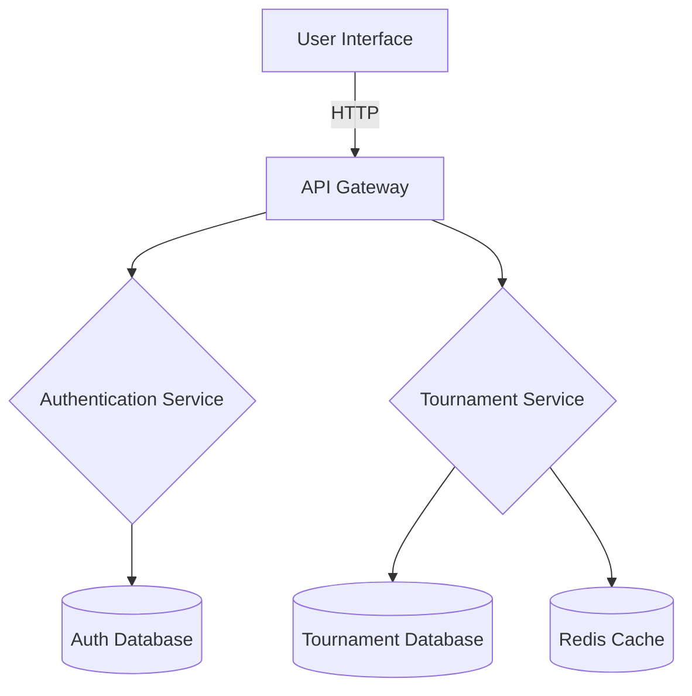

# System Architecture

## Overview
ShuttleChamp is structured to efficiently manage badminton tournaments, leveraging a microservices architecture for scalability and maintainability.

## Component Diagram

## Component Descriptions

### User Interface
- Developed using **Next.js** and **TypeScript**
- Provides a responsive and interactive UI for end-users

### API Gateway
- Acts as a single entry point for all client requests
- Routes requests to appropriate services

### Authentication Service
- Manages user registration, login, and token generation
- Secured using **JWT** with **python-jose**

### Tournament Service
- Handles tournament creation, player registration, and match scheduling
- Connects to PostgreSQL for persistent data storage

### Data Stores
- **PostgreSQL** for relational data
- **Redis** for caching frequently accessed data

## Data Flow
1. **User Request**: Initiated from the UI, processed by the API Gateway
2. **Service Processing**: Requests are routed to the appropriate service (Auth or Tournament)
3. **Database Interaction**: Services interact with PostgreSQL for reading/writing data
4. **Response**: Processed data is sent back to the user via the API Gateway