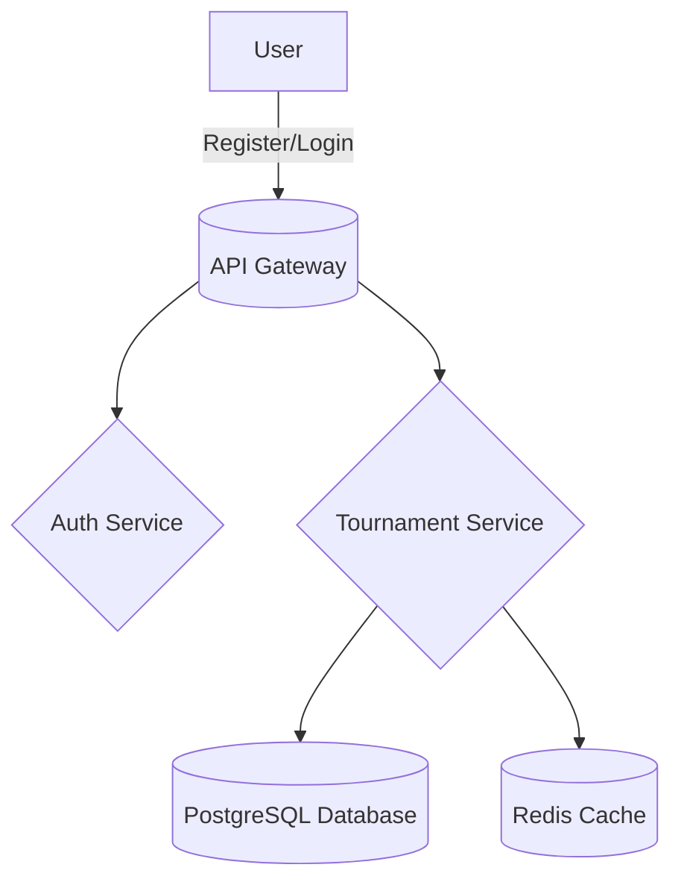

# ShuttleChamp

 

Streamline Your Badminton Tournaments

## Features

- ✓ Tournament Creation
- ✓ Player Registration
- ✓ Match Scheduling
- ✓ Umpire Assignment
- ✓ Score Tracking
- ✓ Tournament Leaderboard
- ✓ Notification System
- ✓ Organizer Dashboard
- ✓ Post-Tournament Analytics
- ✓ User Feedback System

## Quick Start

```bash
# Step 1: Clone the repository
git clone https://github.com/yourusername/ShuttleChamp.git

# Step 2: Navigate to the project directory
cd ShuttleChamp

# Step 3: Start the application using Docker Compose
docker-compose up --build
```

## Prerequisites

| Tool       | Version |
|------------|---------|
| Docker     | 20.10+  |
| Docker Compose | 1.29+ |
| Node.js    | 16+     |

## Docker Compose Setup

```yaml
version: '3.8'
services:
  app:
    build:
      context: .
      dockerfile: Dockerfile
    ports:
      - '8000:8000'
    environment:
      - DATABASE_URL=postgresql://user:password@db:5432/shuttlechamp
      - REDIS_URL=redis://cache:6379
    depends_on:
      - db
      - cache
  db:
    image: postgres:15
    environment:
      POSTGRES_USER: user
      POSTGRES_PASSWORD: password
    volumes:
      - db_data:/var/lib/postgresql/data
  cache:
    image: redis:7
    ports:
      - '6379:6379'
volumes:
  db_data:
```

## API Usage Examples

### Register a User

```bash
curl -X POST http://localhost:8000/api/v1/auth/register -H 'Content-Type: application/json' -d '{"email": "user@example.com", "password": "securepassword", "role": "organizer"}'
```

### Create a Tournament

```bash
curl -X POST http://localhost:8000/api/v1/tournaments -H 'Authorization: Bearer <access_token>' -H 'Content-Type: application/json' -d '{"name": "Summer Open", "location": "Community Center", "start_date": "2023-06-01", "end_date": "2023-06-15"}'
```

## Environment Variables

| Name          | Required | Default               | Description                       |
|---------------|----------|-----------------------|-----------------------------------|
| DATABASE_URL  | Yes      | -                     | URL for the PostgreSQL database   |
| REDIS_URL     | Yes      | redis://localhost:6379| URL for the Redis cache           |
| SECRET_KEY    | Yes      | -                     | Secret key for JWT authentication |

## Architecture Diagram



## Tech Stack

| Component     | Technology            |
|---------------|-----------------------|
| Backend       | Python, FastAPI       |
| Frontend      | Next.js, TypeScript   |
| Database      | PostgreSQL 15, Redis 7|
| Infrastructure| Docker, Nginx         |

## Documentation

For more detailed information, please refer to the [docs folder](./docs).

## License

This project is licensed under the MIT License.